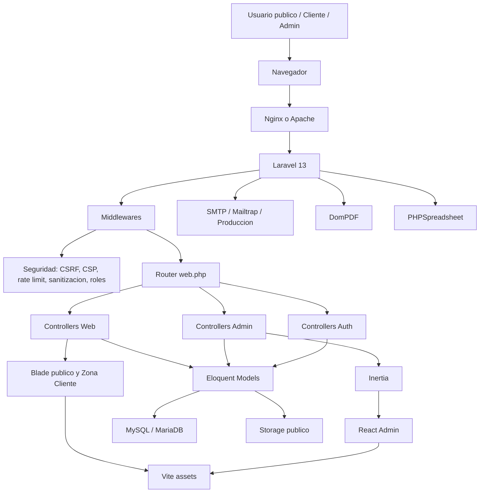
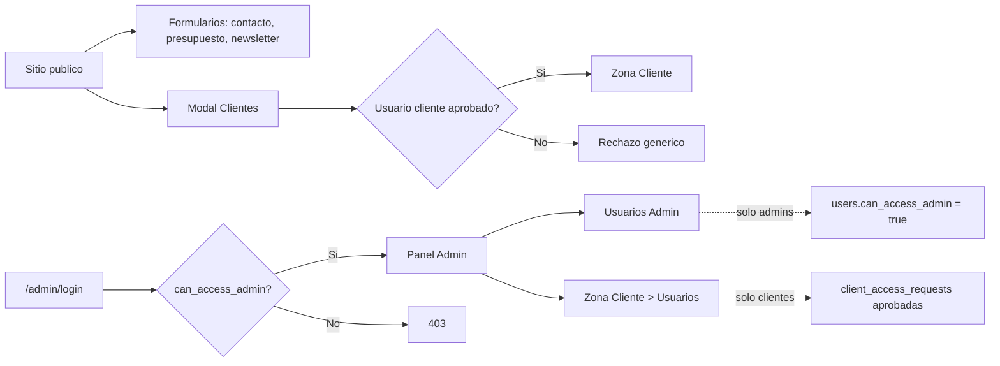
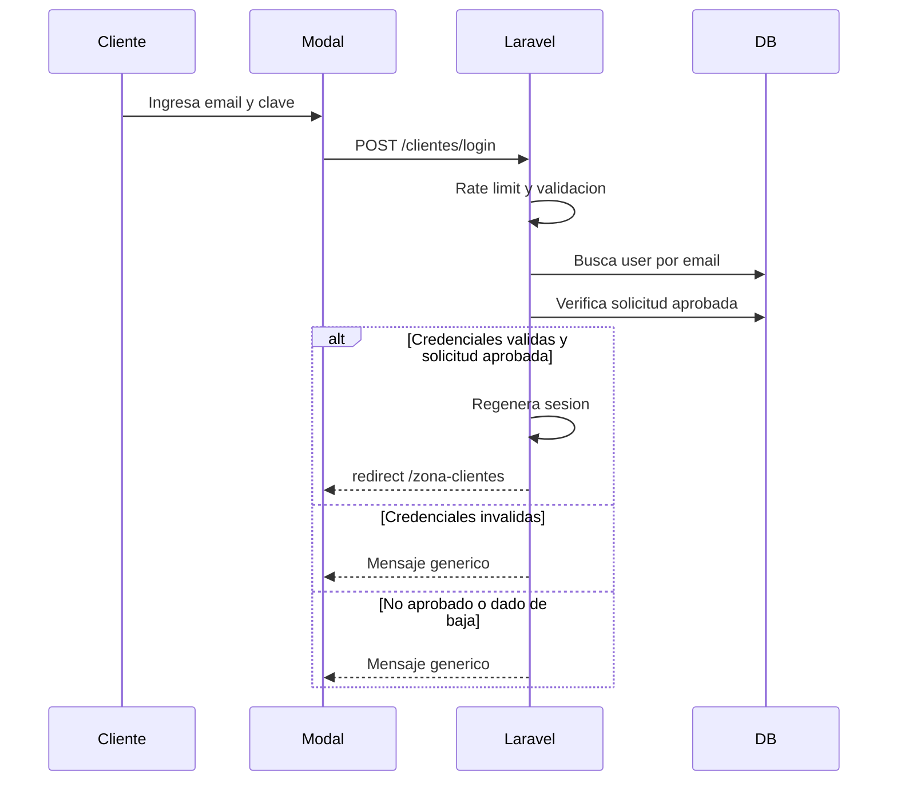
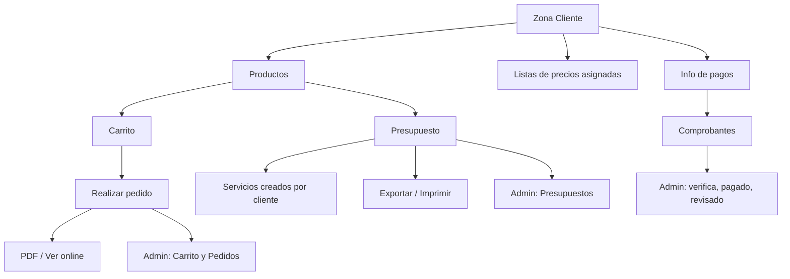
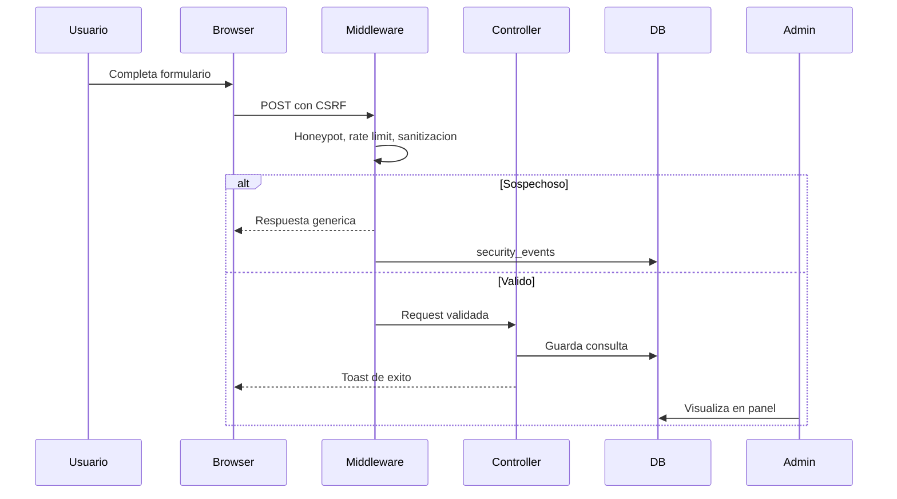
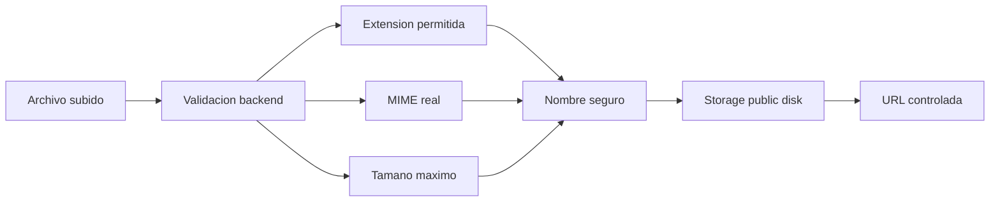
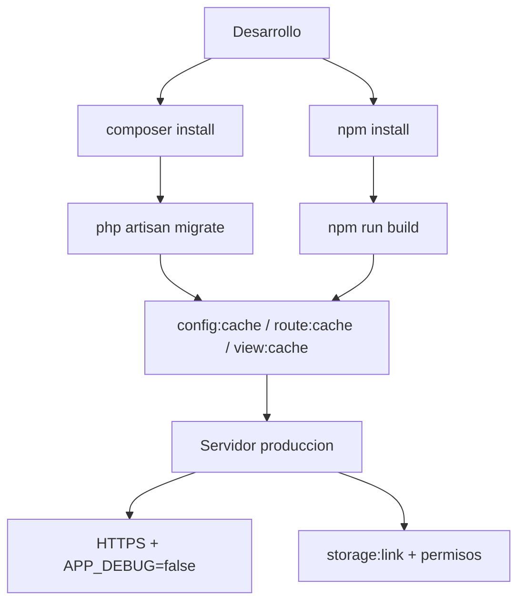
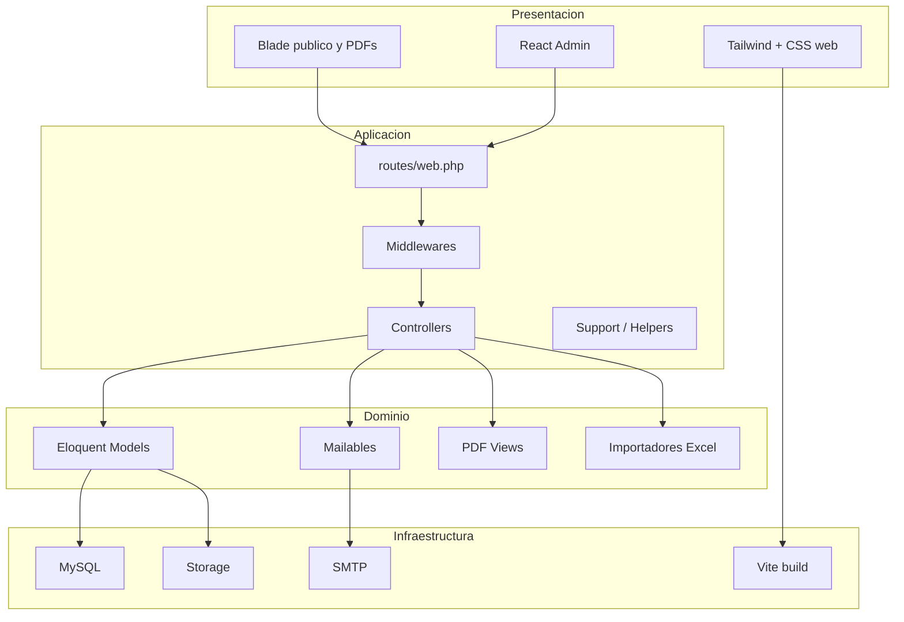

# Diagramas del Proyecto

Diagramas de arquitectura, seguridad y flujos principales del sistema Nicolais Mario e Hijo.

## Arquitectura General

## Separacion de Contextos

## Flujo de Login Cliente

## Flujo de Zona Cliente

## Flujo de Formularios Publicos

## Flujo de Uploads

## Pipeline de Build y Produccion

## Mapa de Capas

